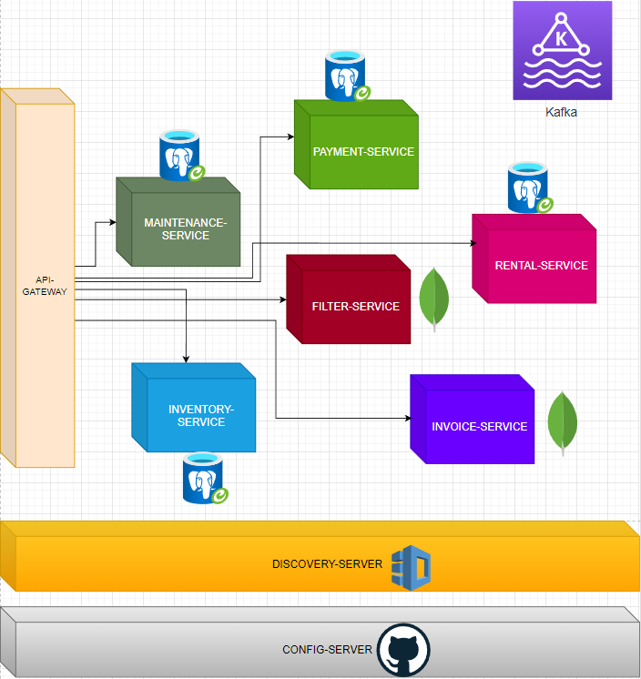

# Rent a Car Microservice Project

### Technology which used
* Zipkin
* MySQL/ PostgreSQL
* Grafana
* MongoDB
* Spring Boot 3
* Prometheus
* Spring Cloud
* API Gateway
* Apache Kafka
* Docker
* Spring Cloud Config Server
* KeyCloak
* Resilience4j
* Spring Boot Actuator
* OpenFeign
* Eureka Discovery Server/Client

<h3 align="center">Project Structure</h3>

  

